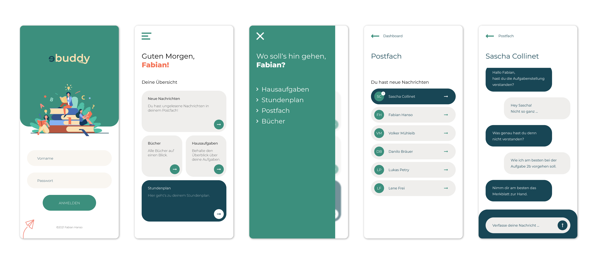

## eBuddy

The smart companion for every pupil & student. You don't want to run to the substitution plan all the time to see if a subject is cancelled? You don't want to carry your heavy backpack anymore? The eBuddy helps you with exactly these problems and also offers a live chat function and a homework book. Thanks to the server connection you have all your data on all your devices.
  

## Screenshot

 

## Demo

[View Live Demo](https://capstone-project-nine-chi.vercel.app/)

 

## Tech-Stack

`React.js`,
`Firebase`,
`React Hooks`,
`React Router`,
`React Testing Library`,
`Styled Components`,
`Material Icons`,
`Mongoose`

 

## Install project

- clone Project
- run `npm i` to install all necessary dependencies
- run `npm start` to run the project locally
- press `control + c` inside the terminal to stop the localhost

 

## © Copyright

Copyright Fabian Hanso 2021
